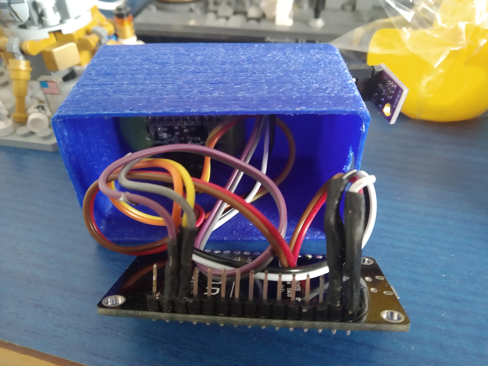
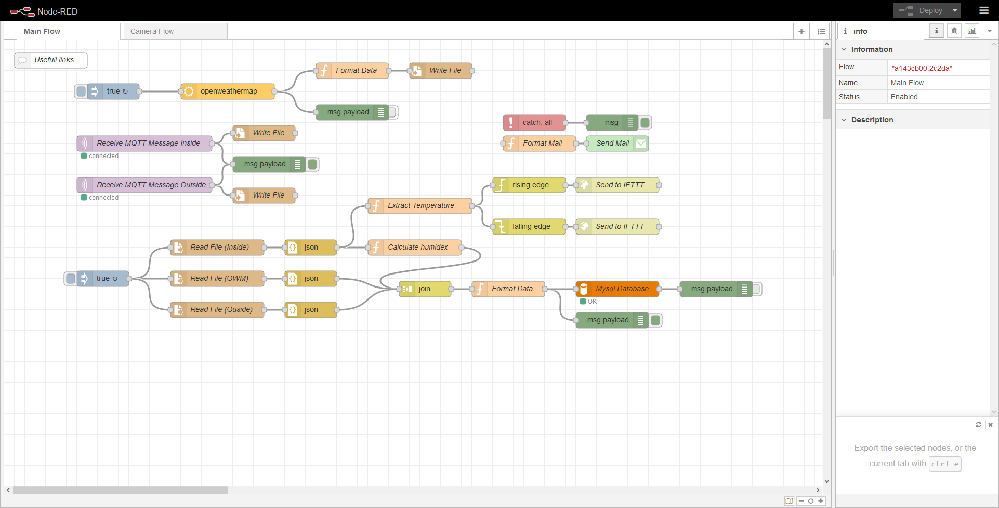

# HomeIOT

My home IOT devices, Composed of 2 weather stations.

- [HomeIOT](#homeiot)
  - [Inside Station](#inside-station)
    - [Components](#components)
    - [Wiring Diargram](#wiring-diargram)
    - [Code explaination](#code-explaination)
      - [Getting sensor data](#getting-sensor-data)
      - [Displaying data on the screen](#displaying-data-on-the-screen)
      - [Sending Data](#sending-data)
  - [Outside station](#outside-station)
    - [Components](#components-1)
    - [Wiring](#wiring)
    - [Code explaination](#code-explaination-1)
      - [Sending Data](#sending-data-1)
      - [Getting sensor data](#getting-sensor-data-1)
  - [Server side](#server-side)
    - [For the weather stations](#for-the-weather-stations)
    - [For the Openweathermap API](#for-the-openweathermap-api)
    - [For the database](#for-the-database)
    - [For the monitoring](#for-the-monitoring)
  - [Data retention](#data-retention)
  - [Data visualisation](#data-visualisation)
  - [Helpfull links](#helpfull-links)


## Inside Station


### Components

The componentes in this build are the folowwing :

|           part            |               role               |
| :-----------------------: | :------------------------------: |
| ESP8266 (Nodemcu variant) |         Microcontroller          |
|          BME280           | Temperature, humidity, pressure  |
|       0.96 Oled I2C       | Display for temperature and time |

### Wiring Diargram




### Code explaination

[See project Code](inside_station/src/main.ino)

This project uses mqtt to send the data. I am utilising the test broker for mosquitto (Was too lazy to set up my own broker).

#### Getting sensor data

reading teh sensor data is made with the Adafruit_Sensor.h and Adafruit_BME280.h libraries. The BME sensors communicates with I²C

```c
humidity = bme.readHumidity();
temperature = bme.readTemperature();
altitude = bme.readAltitude(SEALEVELPRESSURE_HPA);
```

#### Displaying data on the screen

On the inside station i have a small oled screen (see picture above for example). It allow be to show the current inside temperature as webb as the time.
THis displya uses the Adafruit_GFX.h and Adafruit_SSD1306.h libraries. Allow you to create graphics and much more for your displays.
Here is the code used for the display :

```c
void updateLCD()
{
	display.clearDisplay();
	display.setTextSize(1);

	// humidity
	display.setCursor(0, 15);
	display.print(humidity);
	display.print("%");

	// pressure
	display.setCursor(0, 25);
	display.print(pressure);
	display.print("hpa");

	// time
	display.setTextSize(2);
	display.setCursor(0, 0);
	if (hour(serverTime) < 10)
	{
		display.print("0");
	}
	display.print(hour(serverTime));
	display.print(":");
	if (minute(serverTime) < 10)
	{
		display.print("0");
	}
	display.print(minute(serverTime));

	// temperature
	display.setTextSize(5);
	display.setCursor((display.width() / 2) + 3, 0);
	display.print((int)temperature);
	display.setTextSize(2);
	display.setCursor((display.width() / 2) + 3, (display.height() - 15));
	display.print(temperature);

	//line diff
	display.drawLine(((display.width() - 2) / 2), 0, ((display.width() - 2) / 2), display.height(), WHITE);
	display.display();
}
```

It is abit of a pain because you have to set the posiyion each time you xant to write someythings and also trace individual lines.

#### Sending Data

The data is send in a json string so it is easier to manage server side.
Example string send from the esp card

```json
{
  "t_in":"25.4",
  "p":"1200",
  "h_in":"45.3"
}
```

## Outside station

### Components

The componentes in this build are the folowwing :

|           part            |               role               |
| :-----------------------: | :------------------------------: |
| ESP8266 (Wemos variant) |         microcontroller          |
|          ds18b20           | temperature  |

This project uses mqtt to send the data. I am utilising the [test broker for mosquitto](http://test.mosquitto.org/) (Was too lazy to set up my own broker).

### Wiring

The wireing is extremly simple for this one. The sensor is base on the OneWire principle. You ask for the data and it send the data back. The only Specific thing to do is that you need to put a pull up resistor 

### Code explaination

[See project Code](outside_station/src/main.ino)

#### Sending Data

The data is send in a json string so it is easier to manage server side.
Example string send from the esp card

```json
{
  "t_out":28.5
}
```

#### Getting sensor data

```c
sensors.requestTemperatures();
Celcius = sensors.getTempCByIndex(0);
Serial.println(Celcius);
```

## Server side

Now on [node red](https://nodered.org/) ! You can find the node red script [here](node-red.json)

The code doesnt to any treament of the data, it only stores the values in the database



Basicly what happens :

### For the weather stations

1) Node red received the MQTT Values from each station
2) Wites those values to a file

### For the Openweathermap API

1) Every 2 minutes get the data from openWeatherMap
2) Write them to a file

### For the database

1) Every 1 minute read from the 3 files (inside, outside & api)
2) Calclate the Humidex
3) Join those 3 fies into a single JSON
4) Insert the JSON into the database
  
### For the monitoring

1) When the database is calculated get the temperature
2) chek if it is over 28°C or under 15°C
3) Send request to IFTTT
4) Receive the according notification on your phone

## Data retention

To keep all my data I used what I already had. In my cas I already had a mysql database so I made a new table for that.

This is what the table looks like :
```SQL
ID int auto_increment,
Date datetime null,
InsideTemp float null,
OutsideTemp float null,
Pressure float null,
InsideHumidity float null,
OutsideHumidity float null,
```

As of Juin 2020 there is more then 300 000 lignes in that table !

## Data visualisation

I ♥ stats and graphs.

With that said the only logical choice is to use [grafana](https://grafana.com/). Here I can have a whole view of all the data from my diffrent stations and the api.


You can find my dashboard preset [here](grafana.json)

## Helpfull links

- <https://randomnerdtutorials.com/esp32-esp8266-i2c-lcd-arduino-ide/>
- <https://omerk.github.io/lcdchargen/>
- <http://embedded-lab.com/blog/making-simple-weather-web-server-using-esp8266-bme280/>
