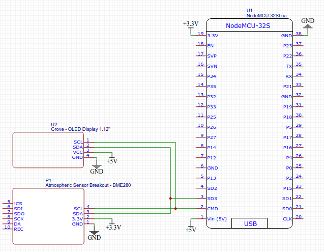

# HomeIOT

My home IOT devices, currently only a weather station.

- [HomeIOT](#homeiot)
  - [Electronics set up](#electronics-set-up)
    - [Weater Station](#weater-station)
      - [Components](#components)
      - [Wiring Diargram](#wiring-diargram)
  - [Code explaination](#code-explaination)
    - [Getting sensor data](#getting-sensor-data)
    - [Displaying data on the screen](#displaying-data-on-the-screen)
    - [Sending Data](#sending-data)
  - [Server side code](#server-side-code)
  - [Data visualisation](#data-visualisation)
  - [Helpfull links](#helpfull-links)

Using grafana to visualise the data

## Electronics set up

### Weater Station

#### Components

The componentes in this build are the folowwing :

|           part            |               role               |
| :-----------------------: | :------------------------------: |
| ESP8266 (nodemcu variant) |         microcontroller          |
|          BME280           | temperature, humidity, pressure  |
|       0.96 Oled I2C       | display for temperature and time |

#### Wiring Diargram



## Code explaination

This project uses mqtt to send the data. I am utilising the test broker for mosquitto (Was too lazy to set up my own broker).7

### Getting sensor data


### Displaying data on the screen


### Sending Data

The data is send in a json string so it is easier to manage server side.
Example string send from the esp card
```json
{
  "t_in":"25.4",
  "p":"1200",
  "h_in":"45.3"
}
```

## Server side code

Currently the code is set up to run as a nodeJS script.
In the future we sould be using nodeRed (to be determined when)

The code doesnt to any treament of the data, it only stores the values in the database


## Data visualisation

I <3 stats and graphs.
With that said the only logical choice is to use graphana


## Helpfull links

https://randomnerdtutorials.com/esp32-esp8266-i2c-lcd-arduino-ide/  
https://omerk.github.io/lcdchargen/
http://embedded-lab.com/blog/making-simple-weather-web-server-using-esp8266-bme280/